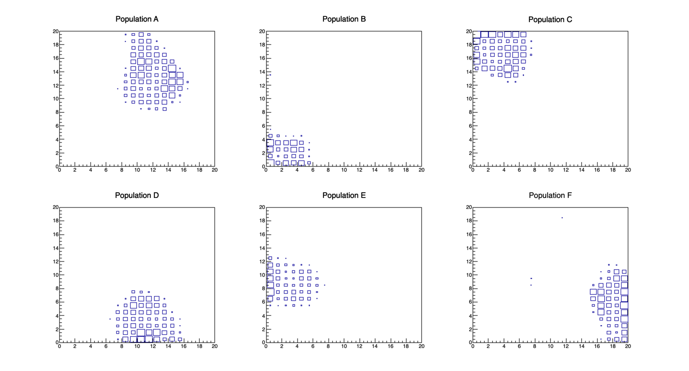

Contents
 - **HexagonNet.pdf**: It was used to derive the function `get_list_of_nodes` inside `networkTrainning.py`.

 - **SOFM.py**: Defines common helper functions that can be used to implement the SOFM algorithm.

 - **generateDataSets.py**: Generates dummy datasets with internally defined mean values. It generates files with vector populations A...G, and a random dataset with all the populations combined to be used as the trainning set, "trainSet.txt". Files are writen to the `data/` directory.

- **networkTrainning.py**: It performs the network trainning and places the resulting network at "data/network.out".

- **evalNetwork.py**: It generates bidimensional histograms using the independent population files and the trainned network to show which cells specialized to identify each region.

Potential questions. Think of ways to quantify your answers

- How it affects the selection if I include only a sub-set of the variables?

- How it affects the networks size to the population identification of events?
    + How much you are allowed to reduce the network size? 
    + How much do you need to increase it to keep improving your result?

- Further cases of study.
	+ Squared or hexagonal network?
	+ What about a 3-dimensional network?

- What about designing a network where we do not define periodical conditions? Will populations accumulate in the corners? If populations accumulate in the walls, there is any problem with periodicity definitions in the algorithm?

- What it happens if we overtrain a population? I.e. we generate a training set with 10-times more events that the other populations.

- Define a purity (or contamination) parameter that tells us the number of other populations found at a given population. How the purity depends on the net properties and trainning? Network size, iterations, R, alpha, etc. The best way to find out the improvements it is to work with the smallest network possible and test the effects.

AddOns:

Look the following tutorial on how to use ROOT with python interface:
https://nyx.physics.mcgill.ca/event/264/contributions/1491/attachments/346/488/slides.pdf

